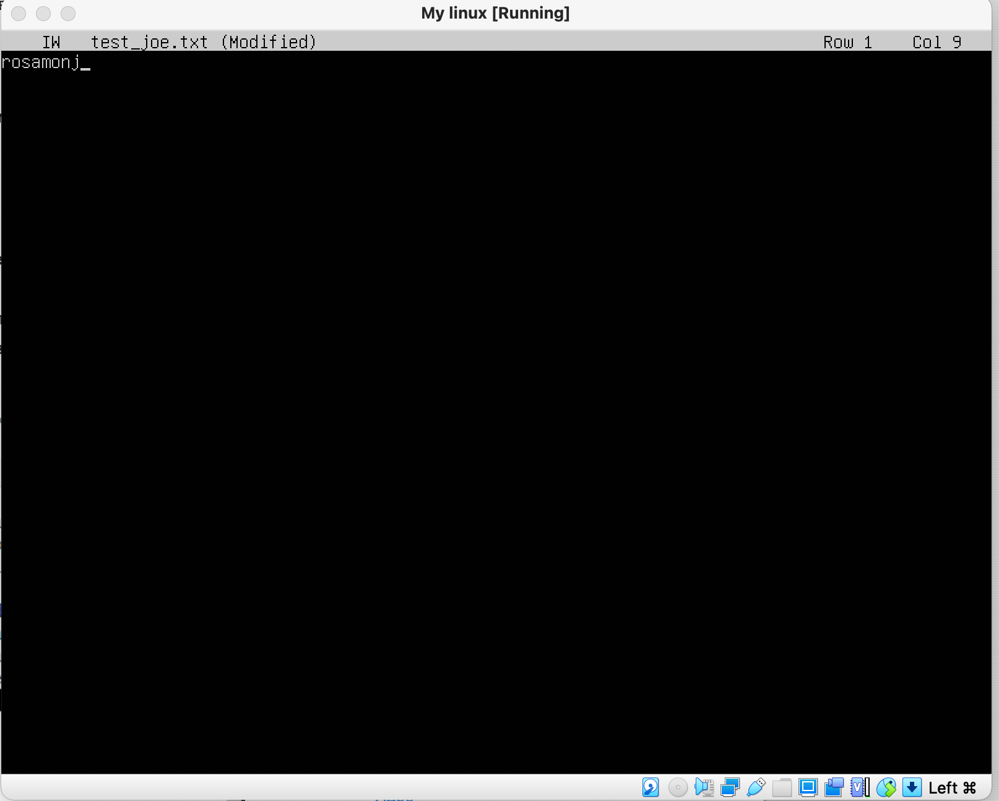
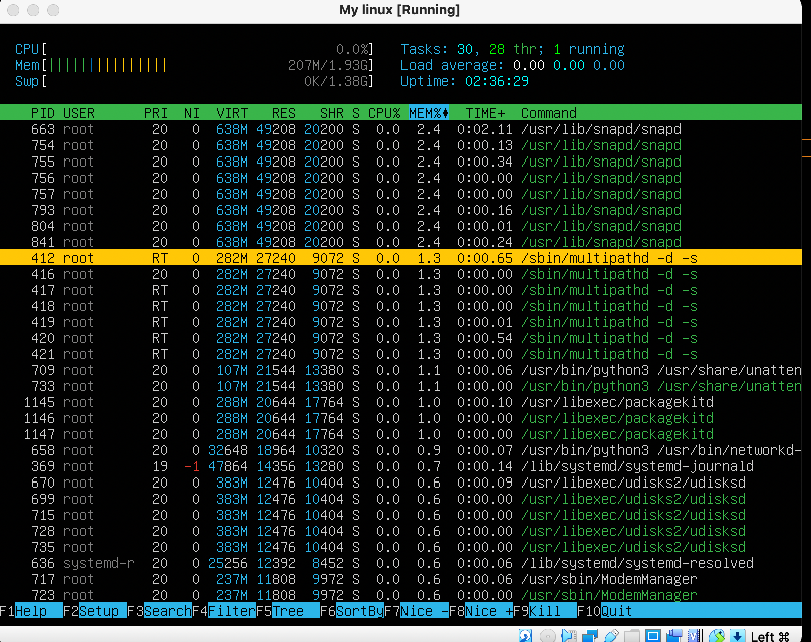

## Part 1. Установка ОС

- через cd .. выхожу в директорию home
- через cd .. выхожу в директорию /
- узнаю версию Ubuntu

## Part 2. Создание пользователя

- с помощью команд sudo adduser создаю нового пользователя sunnyday

- с помощью sudo usermod добавляю пользователя sunnyday в группу adm

- пользователь появился в выводе команды  /etc/passwd

## Part 3. Настройка сети ОС

- открыла файл etc/hostname в vim, перешла в режим вставки (i), изменила имя машины на user-1
 
 
 - узнала свою временную зону с помощью команды timedatectl list-timezones
 - установила временную зону по своему текущему положению timedatectl set-timezone Europe/Moscow
 
 - с помощью команды ip link show вывела список сетевых интерфейсов, интерфейс lo присутствует в linux по умолчанию, используется для отладки сетевых программ и запуска серверных приложений на локальной машине

- DHCP — протокол прикладного уровня модели TCP/IP, служит для автоматизации назначения IP-адреса клиенту. Dynamic Host Configuration Protocol. Помимо автоматизации процесса настройки IP, DHCP позволяет упростить диагностику подключения и переход из одной подсети в другую, оставляя уведомления для системного администратора в логах.
- получение ip устройства через DHCP сервер hostname -I

- внешний ip-адрес шлюза (ip) curl icanhazip.com

- внутренний IP-адрес шлюза, он же ip-адрес по умолчанию (gw) ip route | default

- задать статичные (заданные вручную, а не полученные от DHCP сервера) настройки ip, gw, dns

- с помощью команды sudo netplan try подтвердила новые настройки и обновила систему через reboot
- успешно пропинговала удаленные хосты 1.1.1.1 и ya.ru

## Part 4. Обновление ОС
- sudo apt update показало сколько пакетов нужно обновить

- sudo apt upgrade после выполнения обновления

## Part 5. Использование команды sudo
- sudo (англ. Substitute User and do, дословно «подменить пользователя и выполнить») — программа для системного администрирования UNIX-систем, позволяющая делегировать те или иные привилегированные ресурсы пользователям с ведением протокола работы. Основная идея — дать пользователям как можно меньше прав, при этом достаточных для решения поставленных задач. Программа поставляется для большинства UNIX и UNIX-подобных операционных систем. Команда sudo предоставляет возможность пользователям выполнять команды от имени суперпользователя root, либо других пользователей. Предоставляя привилегии root только при необходимости, использование sudo снижает вероятность того, что опечатка или ошибка в выполняемой команде произведут в системе разрушительные действия.
- добавила пользователя sunnyday в группу sudo, команда: sudo usermod -aG sudo sunnyday

- перешла на пользователя sunnyday su sunnyday и поменяла имя машины через команду sudo 

- после reboot

## Part 6. Установка и настройка службы времени

- Вывод команды timedatectl show, показывающая время часового пояса. Есть строчка NTPSynchronized=yes:

## Part 7. Установка и использование текстовых редакторов
- чтобы сохранить файл перед закрытием в vim нужна команда :wq

- ctrl+O чтобы сохранить изменения и ctrl+x чтобы выйти из редактора nano

-ctrl+KX чтобы сохранить изменения и выйти из joe

- команда :q! в vim для выхода без изменений

- ctrl+x потом n чтобы выйти без сохранения из nano

- ctrl+c и y чтобы выйти из joe без сохранения

- поиск по словам в vim /pattern n и N чтобы перемещаться по совпадениям

- замена слова в vim :s/паттерн, который надо заменить/паттерн, которым заменяем

- ctrl + w поиск слова в nano

- ctrl + \ ввод паттерна, который нужно заменить + Enter + ввод паттерна, на который надо заменить + Enter + Y в nano

- ctrlK F - поиск слова в joe
- ctrlK F + R - поиск и замена слова в joe

## Part 8. Установка и базовая настройка сервиса SSHD

- Установила службу SSHd. sudo apt-get install openssh-server
- Добавила автостарт службы при загрузке системы. sudo systemctl enable ssh

- Перенастроила службу SSHd на порт 2022. Изменила значение строчки Port в файле /etc/ssh/sshd_config

- Используя команду ps, показать наличие процесса sshd. C помощью флага -C

- Команда ps выводит список текущих процессов на вашем сервере в виде таблицы
-A, -e, (a) - выбрать все процессы;
-a - выбрать все процессы, кроме фоновых;
-d, (g) - выбрать все процессы, даже фоновые, кроме процессов сессий;
-N - выбрать все процессы кроме указанных;
-С - выбирать процессы по имени команды;
-G - выбрать процессы по ID группы;
-p, (p) - выбрать процессы PID;
--ppid - выбрать процессы по PID родительского процесса;
-s - выбрать процессы по ID сессии;
-t, (t) - выбрать процессы по tty;
-u, (U) - выбрать процессы пользователя.

- Вывод команды netstat -tan

- значение ключей: -t информация по протоколу TCP -a вывод всех активных подключений TCP и прослушиваемых компьютером портов TCP и UDP. -n вывод активных подключений TCP с отображением адресов и номеров портов в числовом формате без попыток определения имен.
- значение каждого столбца вывода: Proto - Протокол (tcp, udp, raw), используемый сокетом. Recv-Q - Счётчик байт не скопированных программой пользователя из этого сокета. Send-Q - Счётчик байтов, не подтверждённых удалённым узлом.
Local Address - Адрес и номер порта локального конца сокета. Если не указана опция −−numeric (−n), адрес сокета преобразуется в каноническое имя узла (FQDN), и номер порта преобразуется в соответствующее имя службы.  Foreign Address - Адрес и номер порта удалённого конца сокета. Аналогично "Local Address."
- IP-адрес 0.0.0.0 — это немаршрутизируемый адрес IPv4, который можно использовать в разных целях, в основном, в качестве адреса по умолчанию или адреса-заполнителя. Несмотря на то, что адрес 0.0.0.0 может использоваться в компьютерных сетях, он не является адресом какого-либо устройства. Говоря попросту, IP-адрес 0.0.0.0 означает «эта сеть», но для использования в традиционном смысле этот адрес непригоден. Это похоже на ссылку: «Вставьте сюда адрес», или, в зависимости от контекста, «без конкретного адреса назначения». Он действует как резервный, пока не будет назначен действительный маршрутизируемый IP-адрес. Адрес 0.0.0.0 может также появиться в результате ошибки или быть назначен намеренно.

## Part 9. Установка и использование утилит top, htop
- установка утилит sudo apt install top и sudo apt install htop

- uptime - 1:37
- количество авторизованных пользователей - 1 user
- общая загрузка системы - load average 0.00, 0.00, 0.00
- общее количество процессов 103 total
- загрузка cpu - все что в строчке %Cpu(s):
- загрузка памяти - строчка MiB Mem :
- pid процесса занимающего больше всего памяти. Если нажать M, список процессов отсортируется по памяти, в первом столбце первой строчки будет pid процесса, занимающего больше всего памяти

- pid процесса, занимающего больше всего процессорного времени. Если нажать P, список процессов отсортируется по памяти, в первом столбце первой строчки будет pid процесса, занимающего больше всего процессорного времени

- htop отсортированному по:
- PID

- PERCENT_CPU

- PERCENT_MEM

- TIME

- отфильтрованному для процесса sshd

- с процессом syslog, найденным, используя поиск

- с добавленным выводом hostname, clock и uptime

## Part 10. Использование утилиты fdisk

- название жесткого диска - VBOX HARDDISK, его размер - 10 GIB и количество секторов - 20971520.

- no swap

## Part 11. Использование утилиты df

df /

размер раздела 8408452
размер занятого пространства - 4664680
размер свободного пространства - 3295056
процент использования - 59%
единица измерения в выводе - килобайт. 

размер раздела - 8.1G
размер занятого пространства - 4.5G
размер свободного пространства - 3.2G
процент использования - 59%
тип файловой системы для раздела - ext4

## Part 12. Использование утилиты du
- Вывести размер папок /home, /var, /var/log (в байтах, в человекочитаемом виде)

- Вывести размер всего содержимого в /var/log (не общее, а каждого вложенного элемента, используя *)

## Part 13. Установка и использование утилиты ncdu
- размер папки /home

- размер папки /var

- размер папки /var/log

## Part 14. Работа с системными журналами
- Открыть для просмотра: /var/log/dmesg, команда: less /var/log/dmesg

- Открыть для просмотра: /var/log/syslog, команда: less /var/log/syslog

- Открыть для просмотра: /var/log/auth.log, команда: less /var/log/auth.log

- Поиск времени последней успешной авторизации, имени пользователя и метода входа в систему, команда grep LOGIN /var/log/auth.log  Время последней успешной авторизации: 19:15:09, имя пользователя: rosamonj, метод входа: LOGIN.

- Перезапустить службу SSHd, команда: sudo systemctl restart sshd

## Part 15. Использование планировщика заданий CRON
- открыла cron через crontab -e и nano
- запустила команду uptime через каждые 2 минуты.

- grep CRON /var/log/syslog

- список текущих задач crontab -l

- Удалила все задания из планировщика заданий.
