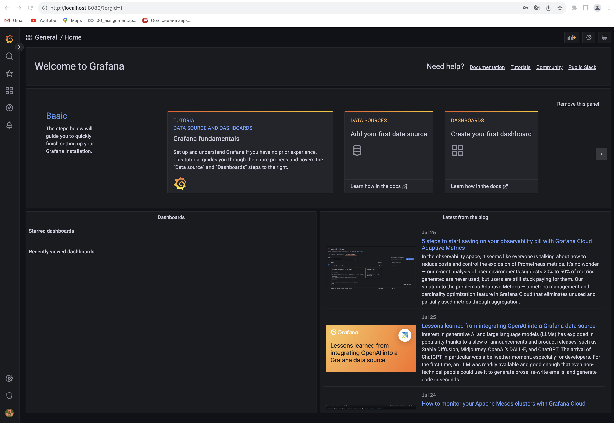

## Part 7. Prometheus и Grafana
- Установила и настроила  Grafana и Prometheus
- Получить доступ к веб интерфейсам Prometheus и Grafana с локальной машины c помощью пробрасывания портов

- Добавить на дашборд Grafana отображение ЦПУ, доступной оперативной памяти, свободное место и кол-во операций ввода/вывода на жестком диске

- Посмотреть на нагрузку жесткого диска (место на диске и операции чтения/записи) после запуска скрипта из второй части

- Установить утилиту stress и запустить команду stress -c 2 -i 1 -m 1 --vm-bytes 32M -t 10s

- Посмотреть на нагрузку жесткого диска, оперативной памяти и ЦПУ
