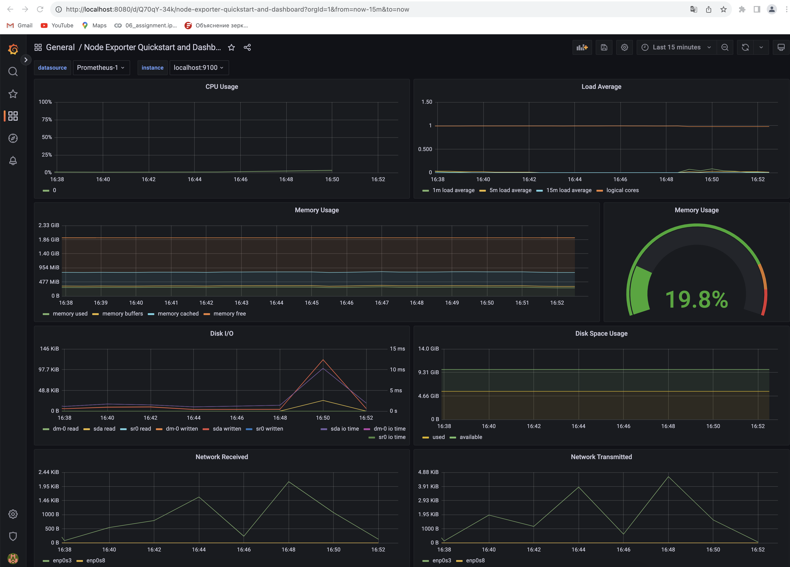
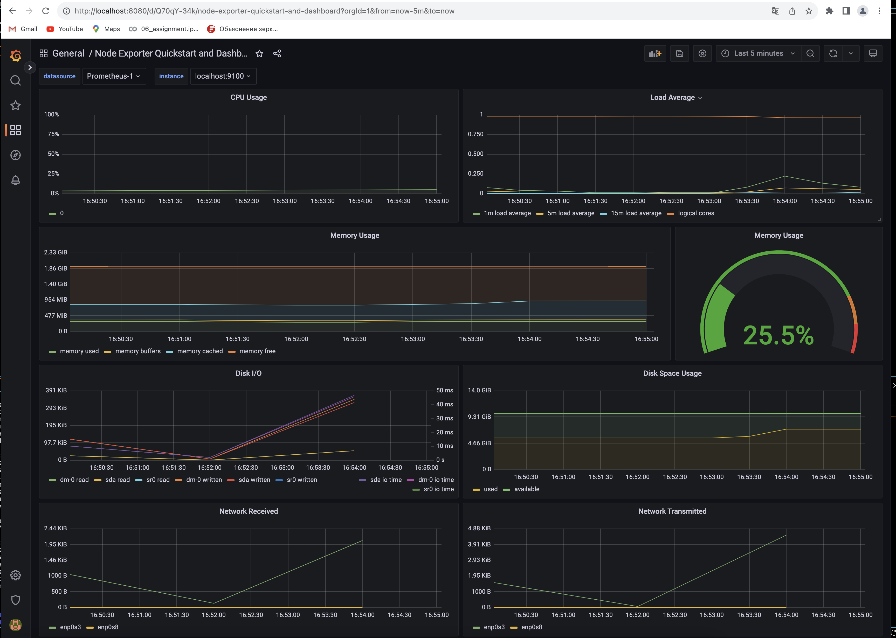
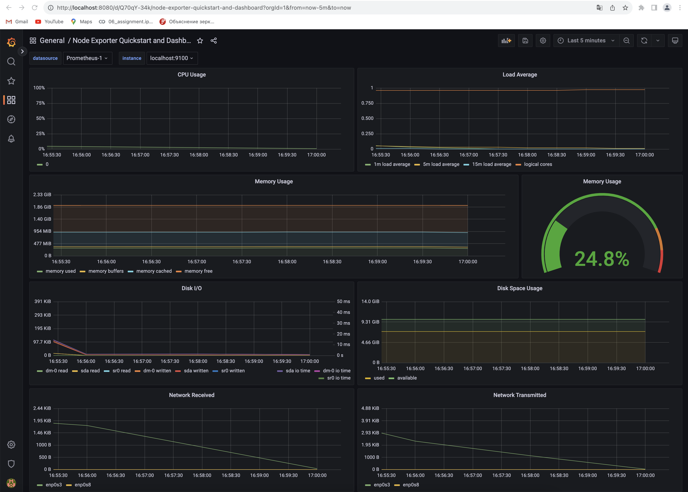
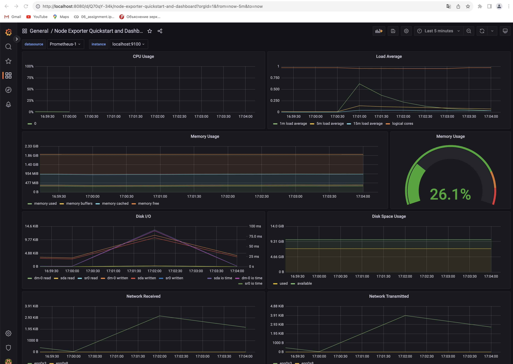
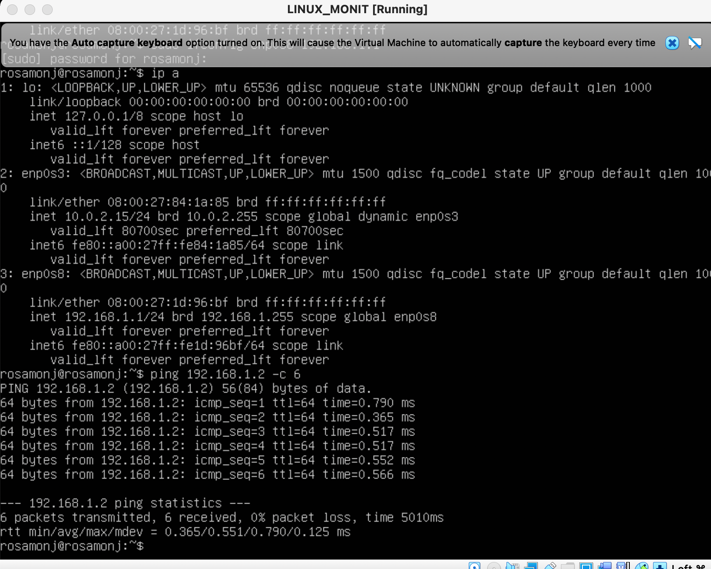
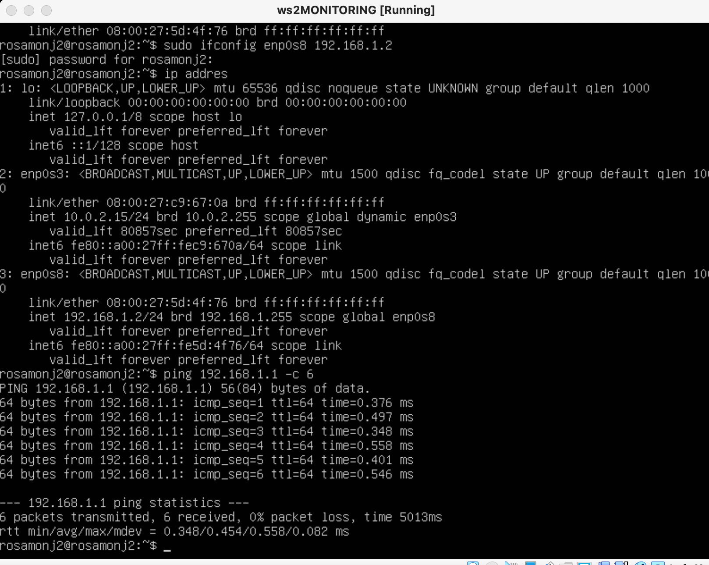
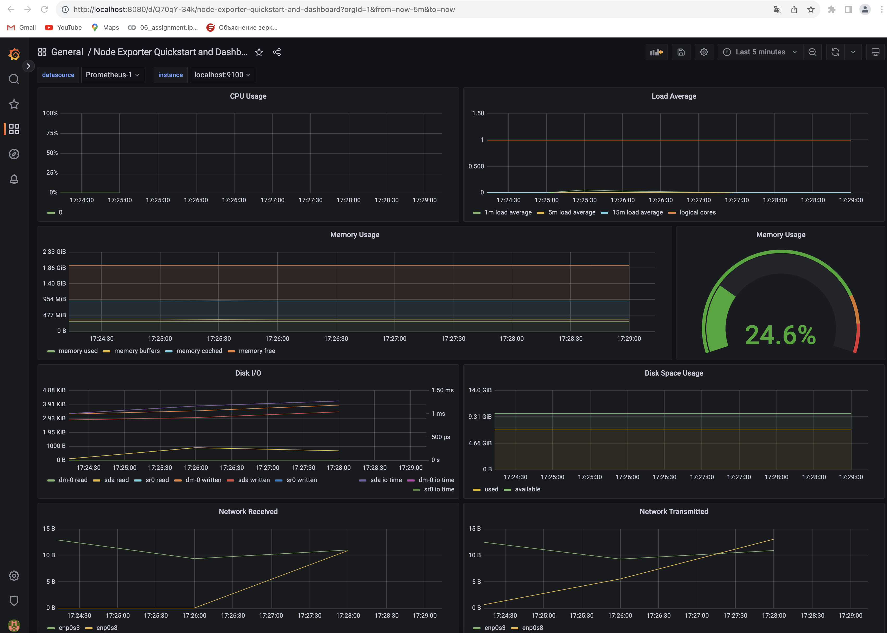
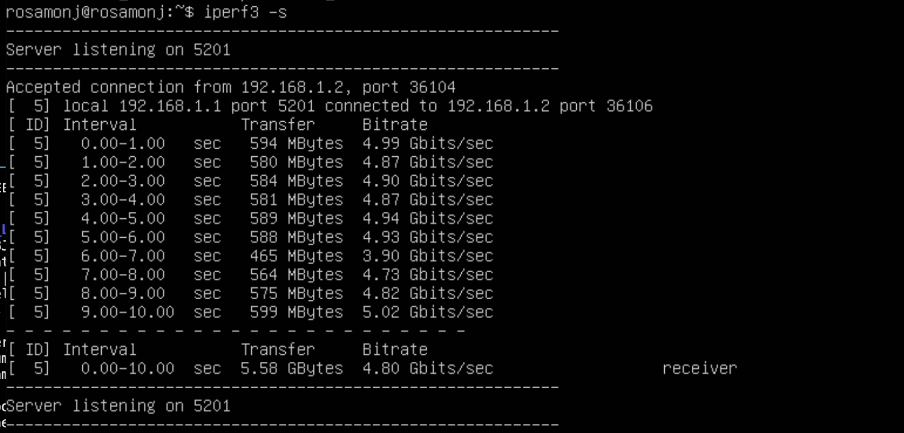
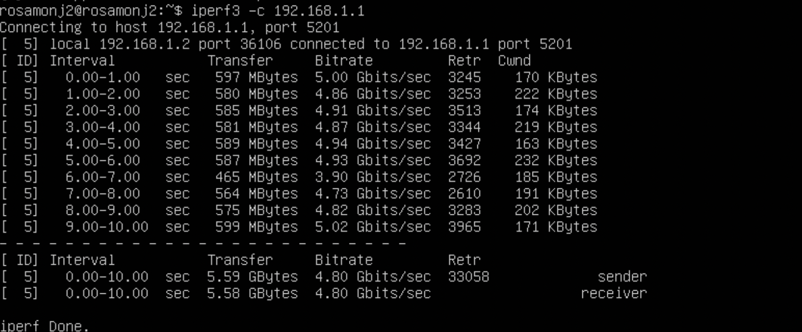
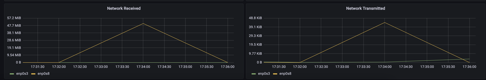

## Part 8. Готовый дашборд
- Установить готовый дашборд Node Exporter Quickstart and Dashboard с официального сайта Grafana Labs
-Провести те же тесты, что и в Части 7
До запуска скрипта из 2й части

После запуска скрипта из 2й части

До stress -c 2 -i 1 -m 1 --vm-bytes 32M -t 10s

После

- Запустить ещё одну виртуальную машину, находящуюся в одной сети с текущей

- Запустить тест нагрузки сети с помощью утилиты iperf3
 Перед тестом

- Посмотреть на нагрузку сетевого интерфейса
 
