## Part 1. Готовый докер
- Cкачиваю докер с помощью команды  sudo apt install docker.io и проверяю его статус с помощью systemctl status docker
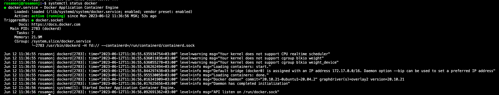
- Взять официальный докер образ с nginx и выкачать его при помощи docker pull
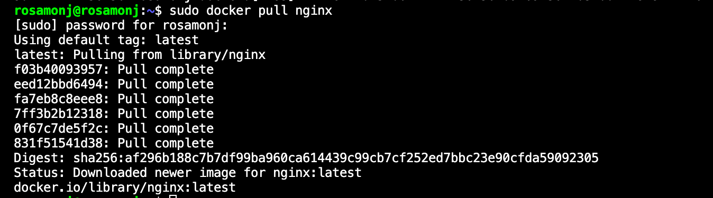
- Проверить наличие докер образа через docker images
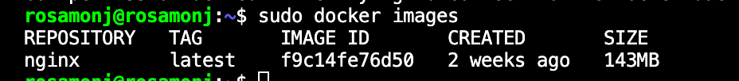
- Запустить докер образ через docker run -d [image_id|repository]
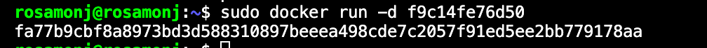
- Проверить, что образ запустился через docker ps
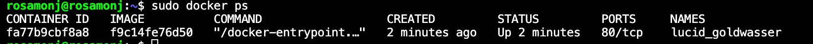
- Посмотреть информацию о контейнере через docker inspect [container_id|container_name]
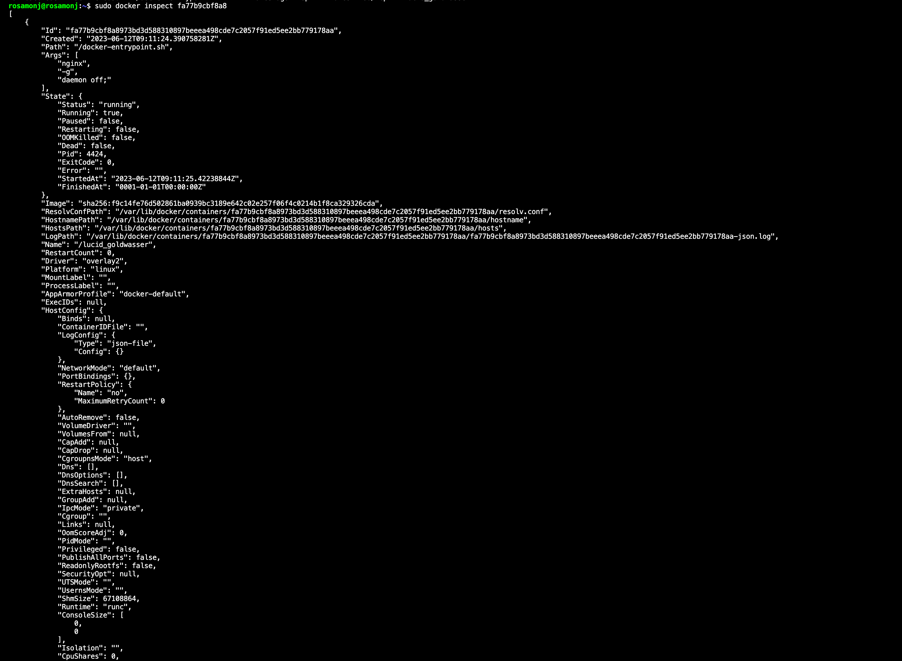
- По выводу команды определить и поместить в отчёт размер контейнера, список замапленных портов и ip контейнера

Размер контейнера

Список замапленных портов (строчка ports)
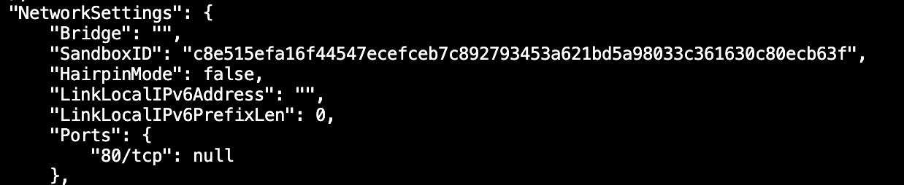

ip контейнера
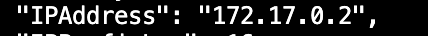
- Остановить докер образ через docker stop [container_id|container_name]
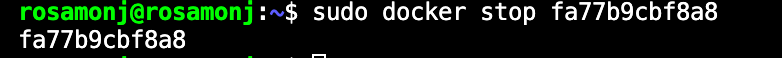
- Проверить, что образ остановился через docker ps
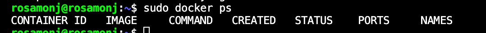
- Запустить докер с портами 80 и 443 в контейнере, замапленными на такие же порты на локальной машине, через команду run
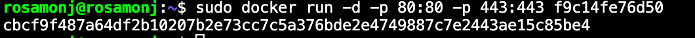
- Проверить, что в браузере по адресу localhost:80 доступна стартовая страница nginx
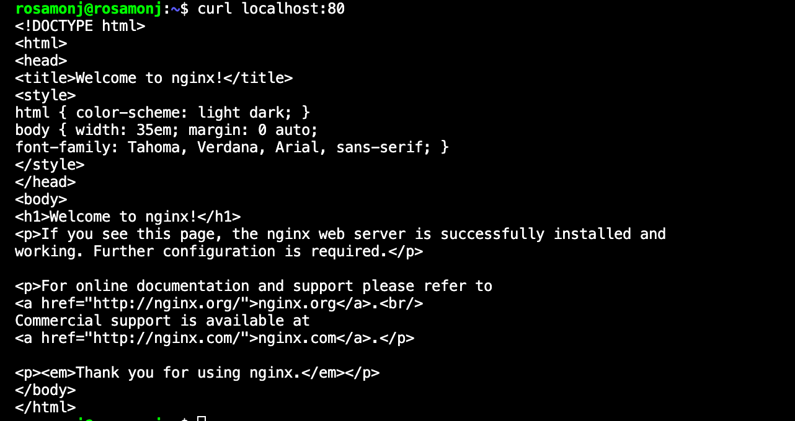
- Перезапустить докер контейнер через docker restart [container_id|container_name]
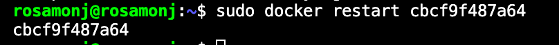
- Проверить любым способом, что контейнер запустился
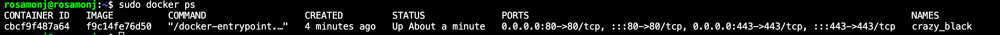
## Part 2. Операции с контейнером
- Прочитать конфигурационный файл nginx.conf внутри докер контейнера через команду exec
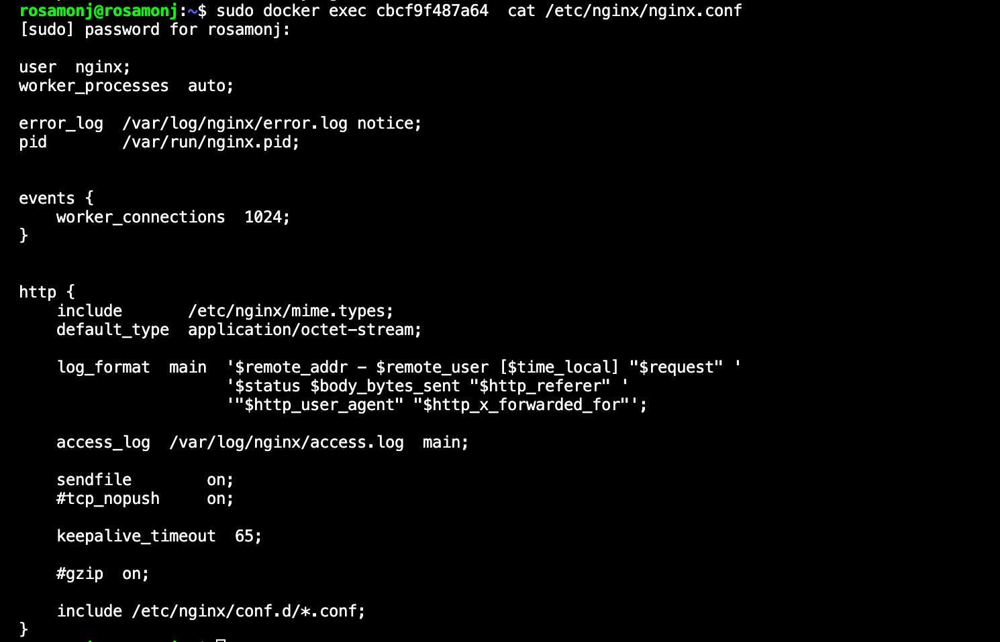
- Создать на локальной машине файл nginx.conf
Создала файл vim nginx.conf (лежит в папке server, на момент выполнения задания лежал в папке rosamonj на виртуалке, поэтому так прописаны пути, потом я его изменила в 3 задании)
- Настроить в нем по пути /status отдачу страницы статуса сервера nginx
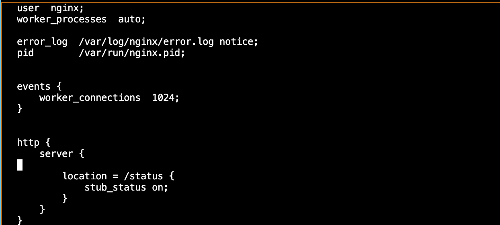
- Скопировать созданный файл nginx.conf внутрь докер образа через команду docker cp
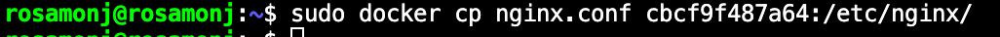
- Перезапустить nginx внутри докер образа через команду exec
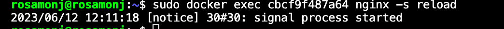
- Проверить, что по адресу localhost:80/status отдается страничка со статусом сервера nginx
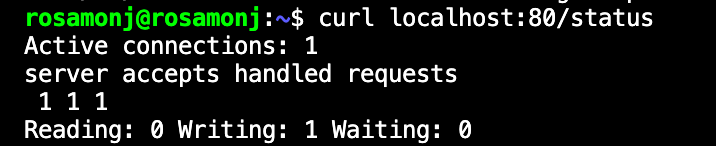
- Экспортировать контейнер в файл container.tar через команду export

- Остановить контейнер

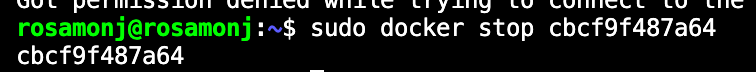

- Удалить образ через docker rmi [image_id|repository], не удаляя перед этим контейнеры
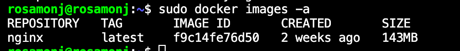
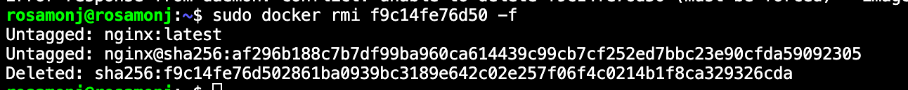

- Удалить остановленный контейнер
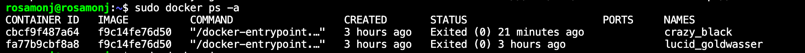
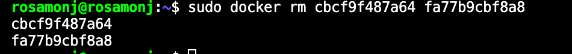
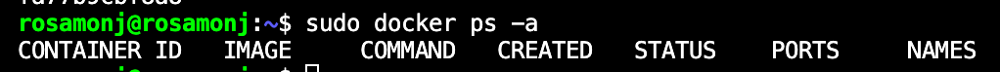
- Импортировать контейнер обратно через команду import
docker import -c 'CMD ["nginx", "-g", "daemon off;"]' container.tar
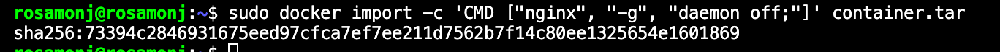
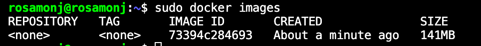
- Запустить импортированный контейнер
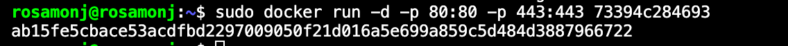
- Проверить, что по адресу localhost:80/status отдается страничка со статусом сервера nginx
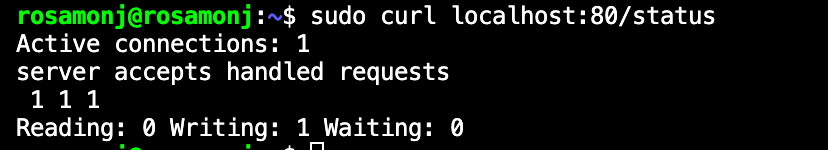
## Part 3. Мини веб-сервер
- Написать мини сервер на C и FastCgi, который будет возвращать простейшую страничку с надписью Hello World!
 Код можно посмотреть в src/server/server.c
- Написать свой nginx.conf, который будет проксировать все запросы с 81 порта на 127.0.0.1:8080
Файл лежит в src/server/nginx.conf
- Запустить написанный мини сервер через spawn-fcgi на порту 8080

Запускаю докер с замапленным портом 81
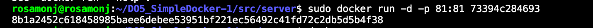
Копирую созданные файлы в докер с помощью docker cp /home/rosamonj/DO5_SimpleDocker-1/src/server/nginx.conf 8b1a2452c618:/etc/nginx/ и docker cp /home/rosamonj/DO5_SimpleDocker-1/src/server/server.c 8b1a2452c618:/home/ (забыла сделать скриншот, сделаю с другим контейнером)
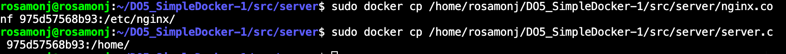
Вхожу в контейнер с помощью docker exec -it container_id bash (exit - выход из докера) и устанавливаю нужные для компиляции пакеты apt install gcc spawn-fcgi libfcgi-dev
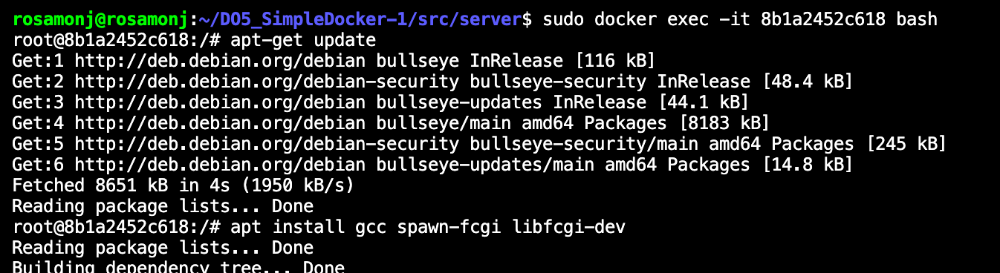
Компилирую сервер

Запускаю сервер
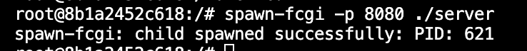
Перезапускаю контейнер
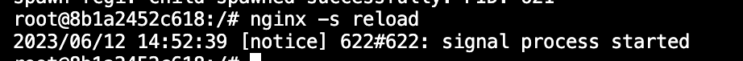
- Проверить, что в браузере по localhost:81 отдается написанная вами страничка
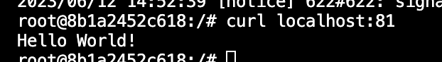
- Положить файл nginx.conf по пути ./nginx/nginx.conf (это понадобится позже)
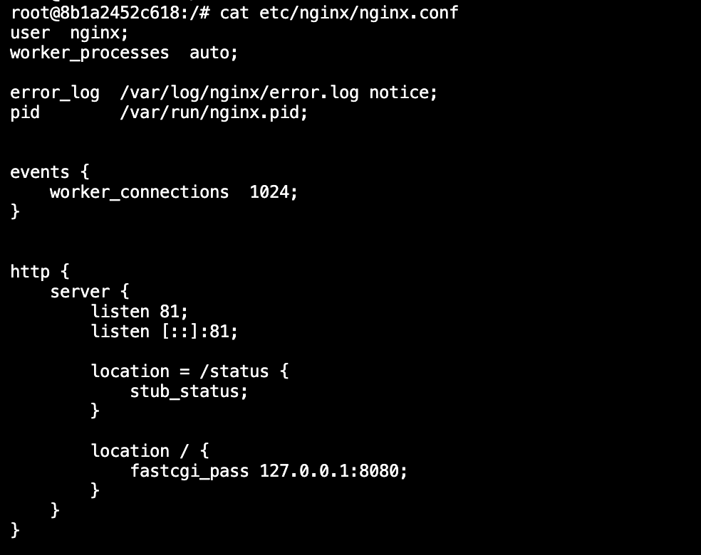
## Part 4. Свой докер
Создала файлы Dockerfile и start.sh (их можно найти в папке 04)
Собрала написанный докер образ командой docker build -t maya:1 .
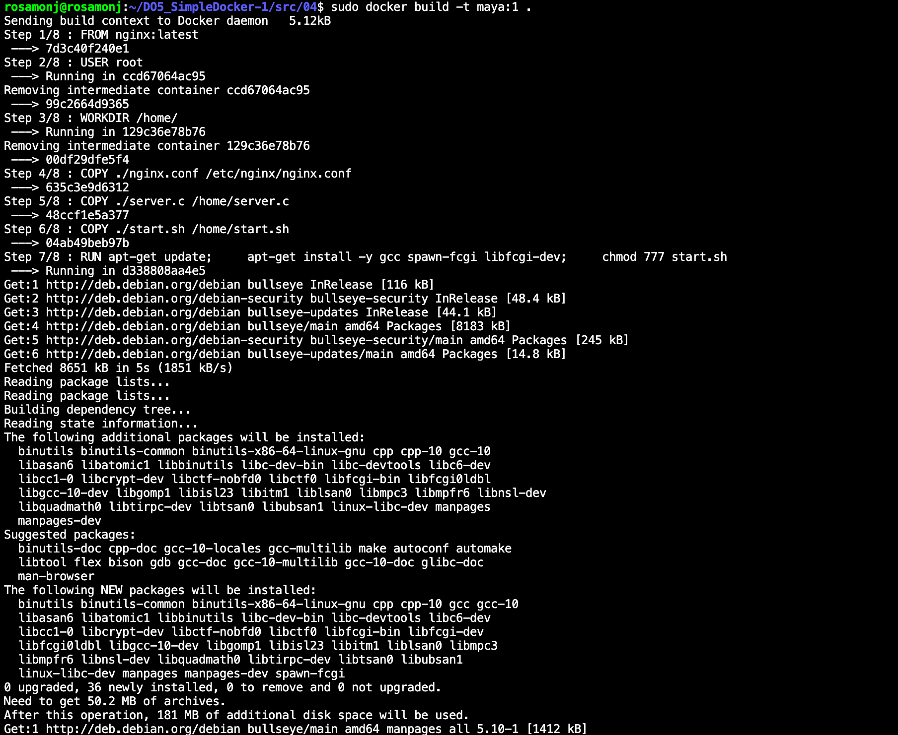
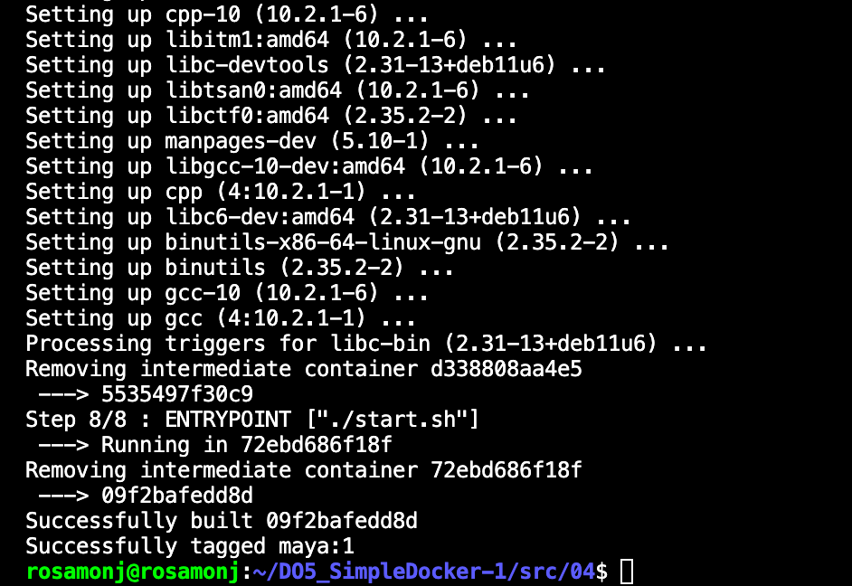
-  Проверим через docker images, что все собралось корректно
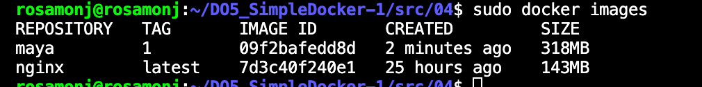
- Запустить собранный докер образ с маппингом 81 порта на 80 на локальной машине и маппингом папки ./nginx внутрь контейнера по адресу, где лежат конфигурационные файлы nginx'а (см. Часть 2)
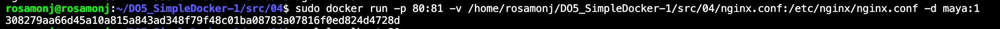
- Проверить, что по localhost:80 доступна страничка написанного мини сервера
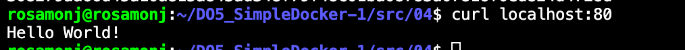
- Дописать в ./nginx/nginx.conf проксирование странички /status, по которой надо отдавать статус сервера nginx
- Перезапустить докер образ
- Проверить, что теперь по localhost:80/status отдается страничка со статусом nginx
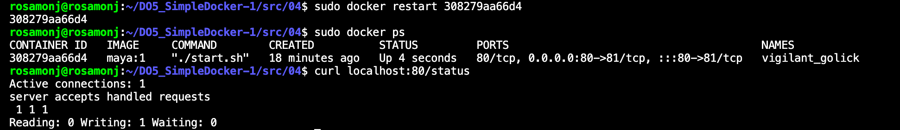

Команды на тот случай, если при проверке что-то пойдет не так: (если все ок, не нужны)
sudo systemctl restart docker.socket docker.service
sudo lsof -i :80
sudo kill <PID>
## Part 5. Dockle
- Просканировать образ из предыдущего задания через dockle [image_id|repository]
Установила dockle
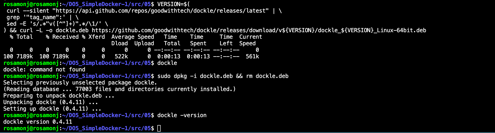
Проверила на dockle
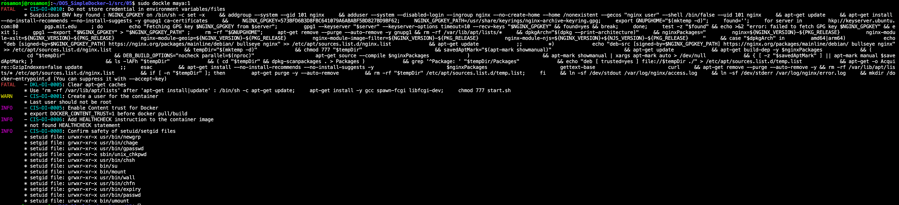
- Исправить образ так, чтобы при проверке через dockle не было ошибок и предупреждений
Удалила образ, обновила Dockerfile, заново собрала образ и просканировала его 
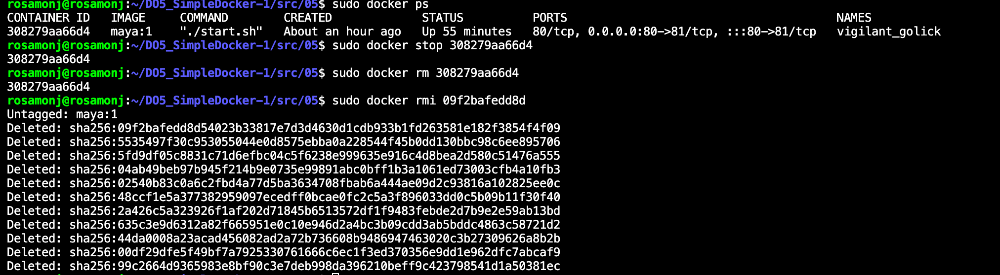
Ориентировалась на информацию в конфе Devops - там говорили, что Info это не ошибка. Также при запуске сканирования я использую тэги, убирающие ошибку CIS-DI-0010, которую не нужно исправлять в контексте этого задания 
sudo dockle -ak NGINX_GPGKEY -ak NGINX_GPGKEY_PATH maya:1
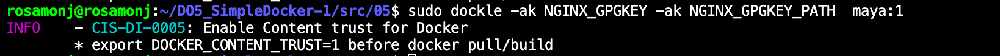
## Part 6. Базовый Docker Compose
- Написала файл docker-compose.yml, его можно найти в папке 06
- Остановить все запущенные контейнеры
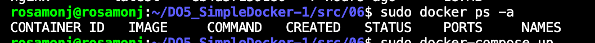
- Собрать и запустить проект с помощью команд docker-compose build и docker-compose up
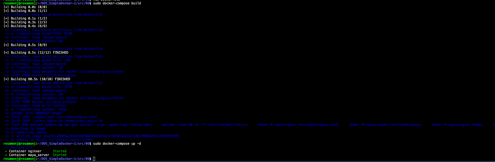
- Проверить, что в браузере по localhost:80 отдается написанная вами страничка, как и ранее
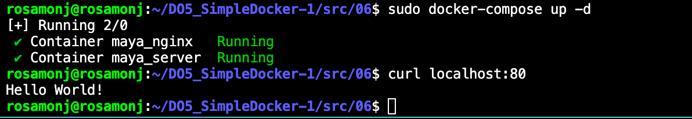