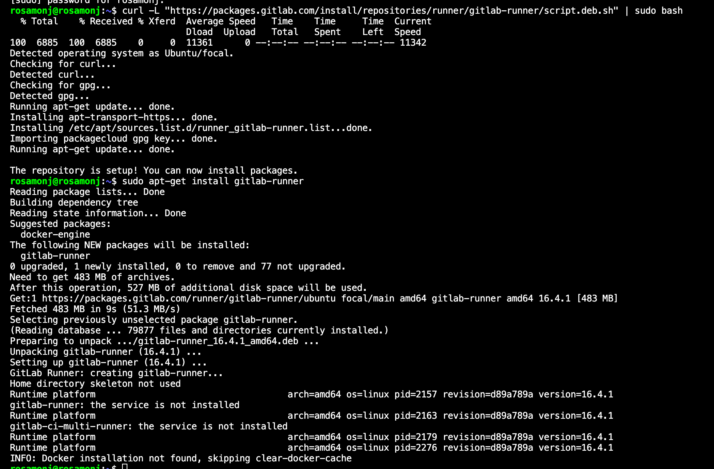
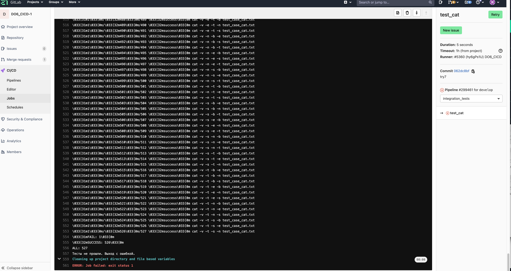

## Part 1. Настройка gitlab-runner
- Поднять виртуальную машину Ubuntu Server 20.04 LTS
- Скачать и установить на виртуальную машину gitlab-runner

- Запустить gitlab-runner и зарегистрировать его для использования в текущем проекте (DO6_CICD)

## Part 2. Сборка
- прописала в gitlab-ci.yml этап  build и проверила его работоспособность

## Part 3. Тест кодстайла
- прописала этап code_style_check, предусмотрела остановку pipeline при наличии ошибок
 
вывод без ошибок

вывод с ошибками, сработал exit 1
## Part 4. Интеграционные тесты
- прописала этап integration_test, предусмотрела остановку pipeline при наличии ошибок

вывод без fail в тестах

вывод, когда есть хоть один fail
## Part 5. Этап деплоя
- связала машины между собой

- файлы на 2 машине

